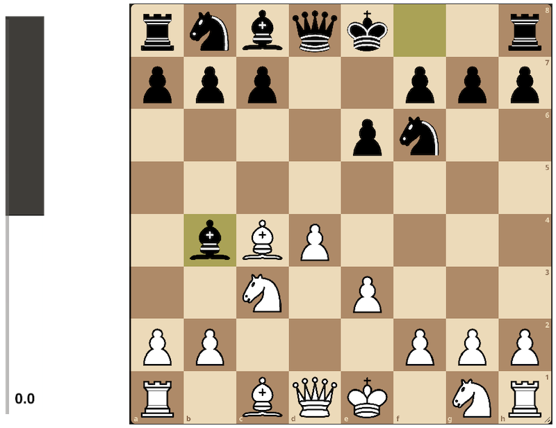

# What is this?

An overlay extension for Twitch that provides a live evaluation bar for chess games played on Lichess.org. An evaluation bar essentially tells you who is winning, it shows the computer evaluation of the current chess position.

## Features
- Resize the bar by dragging the bottom-right corner.
- Move the bar by dragging anywhere on the bar (except the bottom-right corner).

## Configuration
To configure, enter the username of any player on Lichess.org. Live configuration follows same process as normal configuration.

If the player is currently playing, the evaluation bar should fluctuate accordingly. Once the current game ends, the extension waits for the next game to start. Entering a new username through live configuartion makes the eval bar immediately track the new player.

Check it out [here](https://dashboard.twitch.tv/extensions/vf7db8eb7iz5x7wfpr4g7vkd60tr9e-0.0.1)!

    

